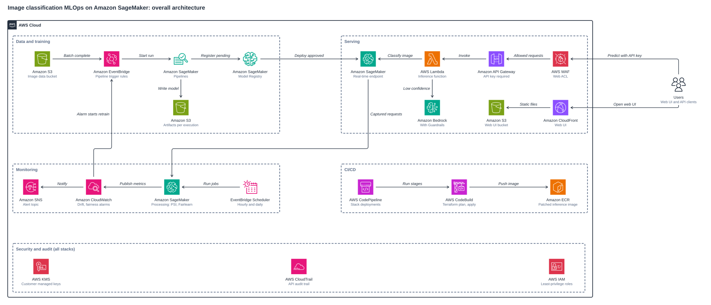
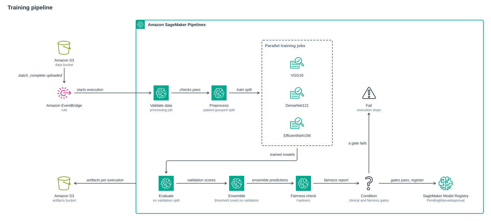
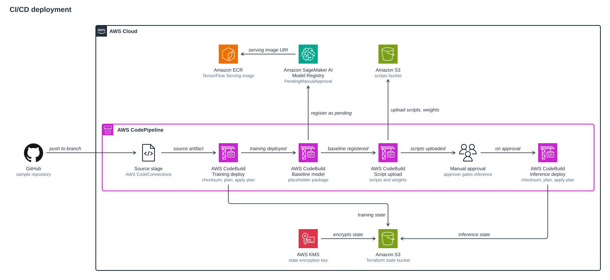

# Image Classification MLOps on Amazon SageMaker

> [!WARNING]
> **Disclaimer.** This is sample code for demonstration and learning. It is
> not a cleared clinical product, has not been validated for diagnostic use,
> and must not be used to make medical decisions. It deploys real, billable AWS
> resources (an always-on SageMaker real-time endpoint, training and Processing
> jobs, AWS WAF and more) that cost money for as long as they exist. Review
> [Costs](#costs), [Cleanup](#cleanup) and [SECURITY.md](SECURITY.md) before
> you deploy, and deploy only into a non-production account you control.

## Overview

This sample is an end-to-end MLOps pipeline for binary image classification on
Amazon SageMaker, written entirely in Terraform. The worked example classifies
breast histopathology images (the public BreakHis dataset) as **benign** or
**malignant**, but nothing in the architecture is specific to that dataset:
change the data and the labels to reuse it for another binary image problem.

It covers the whole lifecycle:

- event-driven data validation and preprocessing with a patient-grouped split,
- three transfer-learning models trained in parallel and combined into an
  ensemble whose decision threshold is tuned on the validation split,
- a clinical quality gate and a Fairlearn fairness gate scored on the test
  split, with a failed gate stopping the pipeline,
- governed deployment: every model registers as `PendingManualApproval`, and a
  person's approval triggers a blue/green endpoint update with auto-rollback,
- a public API behind AWS WAF and an API key, with optional Amazon Bedrock
  reasoning for low-confidence predictions,
- scheduled drift (PSI) and fairness monitoring that can start retraining.

Everything that persists (endpoint, endpoint configuration, auto-scaling,
alarms, schedules, registry) is a Terraform resource. Lambda functions only
orchestrate: they serve predictions, roll an approved model onto the endpoint,
and refresh the endpoint weekly.

## Table of contents

1. [Architecture](#architecture)
2. [What each stack deploys](#what-each-stack-deploys)
3. [Repository structure](#repository-structure)
4. [Prerequisites](#prerequisites)
5. [Quick start](#quick-start)
6. [Deploy through CI/CD](#deploy-through-cicd)
7. [Call the API](#call-the-api)
8. [Monitoring and retraining](#monitoring-and-retraining)
9. [Responsible AI](#responsible-ai)
10. [Costs](#costs)
11. [Cleanup](#cleanup)
12. [Troubleshooting](#troubleshooting)
13. [Security](#security)
14. [Contributing](#contributing)
15. [License](#license)

## Architecture



1. A data batch lands in the image data bucket. When the upload finishes, a
   `.batch_complete` marker object makes an Amazon EventBridge rule start the
   SageMaker pipeline.
2. SageMaker Pipelines validates, preprocesses, trains, evaluates and gates the
   model, writes every artifact under a prefix for that execution, and
   registers a passing ensemble in the SageMaker Model Registry as pending.
3. A reviewer approves a version. The approved model is rolled onto the
   SageMaker real-time endpoint.
4. Users open the web UI through Amazon CloudFront (static files in a private
   S3 bucket) and send images to Amazon API Gateway through AWS WAF with an
   API key. An AWS Lambda function calls the endpoint and, for low-confidence
   results, optionally asks Amazon Bedrock for a guarded explanation.
5. The endpoint captures its responses to S3. EventBridge Scheduler runs a
   drift job every hour and a fairness job every day; both publish metrics to
   Amazon CloudWatch, whose alarms notify Amazon SNS and can start a retraining
   run.
6. The optional CI/CD stack deploys the same stacks with AWS CodePipeline and
   AWS CodeBuild, and a CodeBuild project rebuilds the patched inference image
   in Amazon ECR every month.
7. Across all stacks, customer managed AWS KMS keys encrypt data at rest, IAM
   roles are scoped to the project and bounded by a permissions boundary, and
   an AWS CloudTrail trail can be turned on for audit.

The diagrams are SVG files in [docs/diagrams/](docs/diagrams/); PNG exports
of the same figures are in [docs/diagrams/png/](docs/diagrams/png/).

## What each stack deploys

The sample is four Terraform root modules (stacks) plus reusable modules in
`modules/`. They are applied in this order:

| Order | Stack | Purpose |
| --- | --- | --- |
| 1 | [stack-backend-setup](stack-backend-setup/README.md) | Bootstrap with local state: S3 state bucket, state KMS key, workload permissions boundary |
| 2 | [stack-training](stack-training/README.md) | Data and model buckets, SageMaker pipeline, Model Registry, Model Card, budget, optional MLflow and CloudTrail |
| 3 | [stack-inference](stack-inference/README.md) | Endpoint, API, web UI, auto-deploy, drift and fairness monitoring, Bedrock guardrail |
| 4 (optional) | [stack-cicd](stack-cicd/README.md) | CodePipeline and CodeBuild that apply stacks 2 and 3 from your GitHub repository |

### stack-backend-setup

Creates the versioned, KMS-encrypted Terraform state bucket (S3 native state
locking, no DynamoDB), its KMS key, and the `<project_name>-workload-boundary`
IAM permissions boundary that every role in the other stacks carries. It keeps
its own state locally and prints the `backend.hcl` the other stacks use.

### stack-training

Creates a project KMS key, six S3 buckets (raw data, processed data, scripts,
model artifacts, inference results, monitoring) plus an SBOM bucket by default,
the SageMaker execution role, the Model Package Group, a Model Card, an AWS
Budgets budget, CloudWatch dashboards, and the SageMaker pipeline with its
EventBridge trigger. A managed MLflow tracking server (`enable_mlflow`) and a
multi-region CloudTrail trail (`enable_cloudtrail`) are available but off by
default.



1. Uploading the `.batch_complete` marker to the data bucket fires the
   EventBridge rule, which starts an execution with
   `RetrainingReason=data_upload`.
2. **Validate data** (Processing job) checks image format, resolution, class
   balance and quality.
3. **Preprocess** resizes images to 512 x 512 and writes train, validation and
   test splits grouped by patient, so images of one patient never appear in
   more than one split.
4. **Train** VGG16, DenseNet121 and EfficientNetV2M in parallel training jobs
   with two-phase transfer learning. Training jobs run with network isolation
   by default and read ImageNet weights from the scripts bucket.
5. **Evaluate** tunes each model's threshold on the validation split and
   reports its metrics on the test split.
6. **Ensemble** combines the three models, tunes the ensemble threshold on the
   validation split and scores the test split at that threshold.
7. **Fairness check** runs Fairlearn over the ensemble's own test predictions
   at its tuned threshold, per magnification subgroup.
8. **Condition** requires accuracy >= 0.85, recall >= 0.95, precision >= 0.80,
   AUC >= 0.90 and a fairness disparity <= 0.10. If every check passes, the
   ensemble is registered as `PendingManualApproval`; otherwise the execution
   ends in a Fail step and nothing is registered.
9. Evaluation, ensemble and fairness outputs are written under
   `<prefix>/<pipeline-execution-id>/`, so each model package points at its own
   weights and reports, and approving an older version deploys that version.

### stack-inference

Creates the patched inference image (built once at apply time, then monthly),
the SageMaker model, endpoint configuration and endpoint (Terraform-managed,
with blue/green deployment, auto-rollback alarms and auto-scaling), the
inference Lambda and its Pillow/NumPy layer, the API Gateway REST API with a
usage plan, API key and WAF web ACL, the CloudFront web UI, the auto-deploy
Lambda, the drift and fairness schedules and alarms, the retraining rule, SNS
alerts, a CloudWatch dashboard, a weekly endpoint refresh, and the Bedrock
guardrail when hybrid inference is on.


1. The browser loads the static web UI from CloudFront, which reads it from a
   private S3 bucket.
2. The browser posts the image directly to API Gateway, sending the API key in
   the `x-api-key` header. AWS WAF inspects the request first.
3. API Gateway invokes the inference Lambda, which validates and preprocesses
   the image and calls the endpoint with its request id as `InferenceId`.
4. When hybrid inference is on and the confidence is below the cutoff, the
   Lambda asks Amazon Bedrock for a natural-language explanation, filtered by a
   Bedrock guardrail.
5. The endpoint writes data capture to the monitoring bucket (model output by
   default; request payloads too when `data_capture_input = true`).
6. EventBridge Scheduler starts the PSI drift job hourly and the Fairlearn job
   daily. They read captured predictions, and the fairness job joins them with
   the confirmed outcomes a clinician uploads to the `ground-truth/` prefix.
7. Both jobs publish metrics to CloudWatch, and CloudWatch alarms notify the
   SNS alerts topic.

### stack-cicd

Optional. Creates a CodePipeline with five stages (Source, Training-Deploy,
BaselineModelCreation, Script-Upload, Inference-Deploy with an optional manual
approval), four CodeBuild projects, an artifacts bucket, an SNS topic for
approvals and an AWS CodeConnections connection to your GitHub repository. See
[Deploy through CI/CD](#deploy-through-cicd).

## Repository structure

```
.
|-- stack-backend-setup/   # State bucket, state KMS key, permissions boundary (local state)
|-- stack-training/        # Buckets, SageMaker pipeline, registry, Model Card, budget
|-- stack-inference/       # Endpoint, Lambda, API Gateway, WAF, CloudFront, monitoring
|-- stack-cicd/            # Optional CodePipeline and CodeBuild
|-- modules/               # Reusable Terraform modules (terraform-aws-*)
|-- scripts/               # Code the pipeline and scheduled jobs run, plus mlops_common
|-- ops-scripts/           # Local helpers: layer build, API test, dataset download, cleanup
|-- tests/                 # pytest suite
|-- docs/diagrams/         # Architecture figures (SVG, PNG exports in png/)
|-- .github/workflows/     # GitHub Actions CI (static checks)
|-- Makefile               # Deploy, destroy and local check targets
`-- pyproject.toml         # Ruff, pytest and dev dependency group
```

## Prerequisites

**AWS account**

- An AWS account you can deploy to, with credentials that can create IAM
  roles, KMS keys, S3 buckets, SageMaker, Lambda, API Gateway, WAF, CloudFront
  and CodeBuild resources. Use a dedicated non-production account.
- Deploy in one Region (the stacks default to `us-east-1`).

**Service quotas**

- SageMaker training: the shipped `stack-training/terraform.tfvars` trains on
  `ml.c5.2xlarge` (CPU). To train on GPU (`ml.g*` or `ml.p*`, which selects the
  GPU image automatically), request the matching "for training job usage"
  quota in Service Quotas first; new accounts often have 0.
- SageMaker Processing: `ml.m5.4xlarge`, `ml.m5.large` and `ml.t3.medium` for
  processing job usage.
- SageMaker hosting: one `ml.m5.xlarge` for endpoint usage (up to three with
  the default auto-scaling maximum).

**Amazon Bedrock**

- Hybrid inference is off in the module default but on in the shipped
  `stack-inference/terraform.tfvars` (`enable_bedrock_hybrid_inference = true`).
  When it is on, the model in `bedrock_model_id` (default
  `us.amazon.nova-pro-v1:0`, a cross-Region inference profile) must be
  available to the account. Set it to `false` if you do not want Bedrock.

**Tools**

| Tool | Version | Used for |
| --- | --- | --- |
| Terraform | `~> 1.15` (every stack's `versions.tf`) | All stacks |
| AWS CLI | v2 | `local-exec` build of the patched image, approvals, cleanup |
| Python | 3.13 or later (`pyproject.toml`) | Helper scripts and tests |
| uv or pip | uv recommended | Building the Lambda layer, installing tools |
| make, bash, zip | any recent | Makefile targets, layer build |

`make seed-baseline` and `scripts/download_pretrained_weights.py` build Keras
models locally, so the Python that `python3` resolves to needs `boto3` and
`tensorflow==2.19.0` (the version the endpoint serves). A virtual environment
is the simplest way to keep that separate. `ops-scripts/test_api.py` needs
`requests` and `Pillow`. For the local checks you also need `ruff`, `pytest`
and `checkov` (`pip install --group dev` installs ruff and pytest).

## Quick start

Run everything from the repository root. The Makefile honours
`PROFILE=<name>` (or an exported `AWS_PROFILE`); every deploy target runs
`terraform plan -out` and applies the saved plan.

**0. Configure.** Review `stack-training/terraform.tfvars` and
`stack-inference/terraform.tfvars`: `project_name`, `environment`,
`aws_region`, `budget_alert_emails`, `alert_email`, instance types and the
Bedrock toggle. `training_data_path` must match the prefix
`scripts/data_uploader.sh` writes to (`medical_image_data/`).

```bash
export AWS_PROFILE=<your-profile>
aws sts get-caller-identity
```

**1. Bootstrap the state backend.**

```bash
make bootstrap
```

**2. Write `backend.hcl` for the other stacks.**

```bash
make backend-config
```

**3. Build the Lambda layer.** Optional: `stack-inference` builds the zip at
apply time when it is missing.

```bash
make layer
```

**4. Deploy the training stack.**

```bash
make deploy-training
```

**5. Upload ImageNet weights (network isolation on, the default).** Training
jobs have no internet access, so the trainers read weights from the scripts
bucket. Do this once before the first pipeline run. The target does nothing
when `enable_network_isolation = false`; it needs TensorFlow locally.

```bash
make weights
```

**6. Upload the scripts and seed the baseline model.**

```bash
make seed-baseline
```

The endpoint cannot exist without an approved model, so this registers a
placeholder baseline (a toy network that cannot classify images) as
`PendingManualApproval` and prints its ARN. It does nothing when the group
already holds an approved or pending package.

**7. Approve the baseline.** Nothing is approved automatically; this is a
deliberate manual step.

```bash
GROUP=$(terraform -chdir=stack-training output -raw model_package_group_name)
ARN=$(aws sagemaker list-model-packages --model-package-group-name "$GROUP" \
  --sort-by CreationTime --sort-order Descending --max-results 1 \
  --query 'ModelPackageSummaryList[0].ModelPackageArn' --output text)
aws sagemaker update-model-package --model-package-arn "$ARN" \
  --model-approval-status Approved \
  --approval-description "Placeholder for first endpoint deploy"
```

**8. Deploy the inference stack.** The target looks up the newest Approved
package in the group, the same query the CI/CD Inference-Deploy stage runs;
set `TF_VAR_model_package_arn` to pin a different version.

```bash
make deploy-inference
```

The first apply also builds the patched inference image in CodeBuild and waits
for it, which takes several minutes.

`make deploy-all` runs steps 1 to 6 and 8 in order. It cannot approve the
baseline for you, so on a first run it stops before the inference stack with
`No Approved model package in <group>`; approve the baseline (step 7) and run
`make deploy-inference`.

**9. Train a real model.** Download BreakHis (about 4 GB) and upload it; the
uploader writes the `.batch_complete` marker that starts the pipeline.

```bash
./ops-scripts/data_download_breakhis.sh data/breakhis
./scripts/data_uploader.sh data/breakhis
```

When the execution registers a version, check its metrics in the registry and
approve it with the same `update-model-package` command. The approval event
triggers the auto-deploy Lambda, which rolls the new version onto the endpoint
with a blue/green update. Keep the file names: the patient-grouped split and
the fairness gate read the BreakHis patient id and magnification from them.

## Deploy through CI/CD



1. A push to the tracked branch of your GitHub repository starts the pipeline
   through AWS CodeConnections.
2. **Training-Deploy** installs a pinned Terraform release, verifies it against
   HashiCorp's `SHA256SUMS`, and applies `stack-training` from a saved plan.
3. **BaselineModelCreation** registers the placeholder baseline as
   `PendingManualApproval` on the first run and prints its ARN in the build log.
4. **Script-Upload** uploads the pipeline scripts and the ImageNet weights to
   the scripts bucket.
5. **Inference-Deploy** waits for the manual approval action
   (`require_manual_approval`, default `true`), then builds the Lambda layer and
   applies `stack-inference` with the newest Approved package in the group. It
   fails if no package is approved yet.
6. Both Terraform stages keep their state in the KMS-encrypted state bucket
   created by `stack-backend-setup`.

Steps:

1. Push this repository to a GitHub repository you own.
2. Run `make bootstrap` and `make backend-config` (the pipeline uses the same
   state bucket).
3. In `stack-cicd/terraform.tfvars`, set `github_owner`, `github_repo`,
   `github_branch` and `state_bucket_name` (printed by `make backend-config`).
   They have no usable defaults and the placeholders are rejected.
4. Run `make deploy-cicd`.
5. Complete the CodeConnections handshake once: in the console open
   Developer Tools > Settings > Connections, select `<project_name>-github`,
   choose **Update pending connection**, and install the AWS Connector for
   GitHub app on the account that owns your repository. Check that
   `terraform -chdir=stack-cicd output github_connection_status` shows
   `AVAILABLE`.
6. Run the pipeline: choose **Release change** in CodePipeline or push to the
   tracked branch.
7. On the first run, approve the baseline package (ARN in the
   BaselineModelCreation log, command as in Quick start step 7) before you
   approve the pipeline's manual approval action.

Subscribers in `approval_notification_emails` must confirm the SNS
subscription before they get approval notices.

## Call the API

The API requires an API key in the `x-api-key` header. Terraform outputs the
URL and the key:

```bash
API_URL=$(terraform -chdir=stack-inference output -raw api_gateway_url)
API_KEY=$(terraform -chdir=stack-inference output -raw api_key_value)
python3 ops-scripts/test_api.py --api-url "$API_URL" --api-key "$API_KEY" \
  --image-path data/breakhis/breast_benign/<file>.png
```

Without `--image-path` the script samples `--count` images per class from
`--data-path` (default `data/`) and checks each prediction against the folder
label. Without `--api-url` and `--api-key` it reads both from `terraform
output`.

The API has two routes:

- `POST /predict` with a JSON body `{"image": "<base64 image>"}`. The response
  carries `request_id`, `prediction`, `confidence`, `probabilities`,
  `threshold_used`, `routing` and, when hybrid inference answers, `reasoning`.
  Images larger than `max_image_bytes` (5 MB by default) return HTTP 413.
- `GET /results/{request_id}` returns the stored prediction for that request.

The web UI is at `terraform -chdir=stack-inference output -raw
frontend_cloudfront_url`. It carries the same API key, so the key identifies
and meters callers; it does not authenticate them (see [SECURITY.md](SECURITY.md)).

## Monitoring and retraining


1. A drift or fairness alarm in CloudWatch changes state to ALARM.
2. An EventBridge rule starts the SageMaker pipeline with
   `RetrainingReason=drift_detected`.
3. A version that clears the gates is registered as `PendingManualApproval`
   and waits for a reviewer.
4. The reviewer approves the package in the Model Registry.
5. The approval state change triggers an EventBridge rule that invokes the
   auto-deploy Lambda.
6. The Lambda creates a model and endpoint configuration for the approved
   package and updates the endpoint. SageMaker shifts traffic blue/green and
   rolls back automatically if the endpoint's 5XX or model-error alarm fires.
7. Failed asynchronous invocations of the Lambda go to an Amazon SQS
   dead-letter queue, and a queue-depth alarm notifies the SNS alerts topic.

What the monitors measure:

- **Drift** (`scripts/drift/compute_drift.py`, hourly): the Population
  Stability Index of the endpoint's malignant-probability scores over the last
  24 hours against a baseline score distribution. The alarm threshold is
  `drift_threshold` (0.2 by default, 0.1 in the shipped tfvars). It publishes
  nothing with fewer than 30 captured predictions or without a baseline. The
  auto-deploy Lambda writes the baseline after each rollout: it copies the
  deployed package's test scores (`predictions.json` next to its
  `model.tar.gz`) to
  `s3://<monitoring-bucket>/monitoring/baselines/output-only/statistics.json`.
  The placeholder baseline has no test scores, so drift is reported only once a
  trained model has been approved and rolled out.
- **Fairness** (`scripts/fairness/compute_fairness.py`, daily): joins captured
  predictions with confirmed outcomes uploaded as JSON Lines
  (`{"request_id": ..., "label": 0|1, "group": "<subgroup>"}`) to the
  `ground-truth/` prefix of the monitoring bucket, and publishes the larger of
  the demographic-parity and equalized-odds differences. The sample does not
  populate that prefix; until someone does, the job publishes no metric.
- **Operations**: API Gateway 4XX/5XX, endpoint errors and latency alarms, a
  composite health alarm, and a CloudWatch dashboard. Set `alert_email` to get
  the SNS notifications.

`ops-scripts/ops_generate_endpoint_traffic.py` sends labelled images straight
to the endpoint to seed data capture before real traffic exists, and
`ops-scripts/verify_monitoring.sh` checks that the alarms, topics and rules
exist. The drift and fairness jobs need data capture, so they are skipped when
`use_serverless_inference = true`.

## Responsible AI

- **Fairness gate in the pipeline.** Fairlearn scores the ensemble that would
  be registered, at its tuned threshold, per subgroup. BreakHis carries no
  demographic data, so the subgroup is image magnification, an honest proxy.
  With fewer than two subgroups the result is "not evaluable" and the gate
  fails. Supply a real sensitive attribute before drawing any fairness
  conclusion.
- **Fairness on live traffic**, held to the same bar, once confirmed outcomes
  are uploaded (see above).
- **Human approval** before any model serves traffic, including the baseline
  and drift-triggered retrains.
- **Model Card** recording intended use, a High risk rating and clinical
  caveats (`enable_model_card`).
- **Hybrid inference** (optional): low-confidence predictions get a Bedrock
  explanation constrained by a guardrail (content filters, name
  anonymization).
- **Human review with Amazon A2I** (optional, `enable_human_review`, off by
  default). Amazon A2I is in maintenance mode and not open to new customers, so
  this only works in accounts that already use it.

## Costs

You pay for the resources while they exist. There are no NAT gateways, AWS
Network Firewall or VPC endpoints by default (nothing runs in a VPC unless you
set `vpc_config` in `stack-training`). Estimate your configuration with the
[AWS Pricing Calculator](https://calculator.aws/).

| Resource | Billed | Notes |
| --- | --- | --- |
| SageMaker real-time endpoint (`ml.m5.xlarge`, 1 to 3 instances) | Every hour it runs | The main standing cost, about $170 per month for one instance in `us-east-1` (the estimate in the variable descriptions; check your Region). `use_serverless_inference = true` scales to zero but disables data capture and monitoring |
| SageMaker training jobs | Per run | 3 jobs per execution; CPU `ml.c5.2xlarge` in the shipped tfvars, GPU if you change it. Managed Spot is available (`enable_managed_spot_training`) |
| SageMaker Processing jobs | Per run | 5 per pipeline execution, plus the hourly drift job and daily fairness job (`ml.t3.medium`, capped at 900 s) |
| AWS WAF | Monthly per web ACL and rule, plus per request | One regional web ACL with three rules (`api_enable_waf`) |
| API Gateway, Lambda, CloudFront | Per request | Low at demo traffic |
| Amazon Bedrock | Per token | Only for low-confidence predictions when hybrid inference is on |
| SageMaker MLflow tracking server | Every hour it runs | Off by default (`enable_mlflow`) |
| AWS CloudTrail trail | Per event delivered, plus S3 | Off by default (`enable_cloudtrail`); leave it off when an organization trail covers the account |
| Amazon S3 | Storage and requests | Buckets are versioned; images, capture and model artifacts accumulate |
| CodeBuild, ECR | Build minutes, storage | Monthly patched-image rebuild; the last 10 images are kept; CI/CD builds if you use `stack-cicd` |
| KMS, CloudWatch, SNS, SQS, EventBridge | Keys, metrics, alarms, logs | Small |

`stack-training` creates an AWS Budgets budget (`monthly_budget_usd`, default
200) scoped by the `Project` tag; set `budget_alert_emails` to be notified.
Destroy the stacks when you are not using them.

## Cleanup

`force_destroy` is `false` on the buckets, so they must be emptied before
Terraform can delete them. `make destroy` does that for you:

```bash
make destroy PROFILE=<your-profile>
```

It runs `ops-scripts/cleanup_all.sh --destroy`, which asks you to type the
project name, then:

1. deletes what pipeline runs and Lambda functions created outside Terraform
   (endpoint, endpoint configurations, models, model packages, job log groups),
2. empties the project's buckets, including all object versions, and never
   touches the Terraform state bucket,
3. runs `terraform destroy` in `stack-cicd`, then `stack-inference`, then
   `stack-training` (`stack-inference` reads `stack-training` state, so this
   order matters).

Finally, empty the state bucket (it keeps state versions) and destroy the
bootstrap stack:

```bash
cd stack-backend-setup && terraform destroy
```

Run `./ops-scripts/cleanup_all.sh --help` for `--project`, `--region`,
`--state-bucket` and `--yes`. Afterwards, check in the console that the
SageMaker endpoint and, if you enabled it, the MLflow tracking server are gone.
Custom CloudWatch metrics cannot be deleted and expire on their own.

## Troubleshooting

| Symptom | Cause and fix |
| --- | --- |
| Pipeline Source stage fails, or `github_connection_status` is `PENDING` | The CodeConnections handshake is not complete. Finish it in Developer Tools > Settings > Connections (see [Deploy through CI/CD](#deploy-through-cicd)), then release the change again. |
| Training job fails with `ResourceLimitExceeded` | No quota for the training instance type. Request the "for training job usage" quota in Service Quotas, or train on CPU (`ml.c5.2xlarge`, the shipped value). Instance types starting `ml.g` or `ml.p` use the GPU image; others use the CPU image. |
| Training job fails at start or cannot load weights | Network isolation is on and `pretrained-weights/` in the scripts bucket is empty. Run `make weights` (Quick start step 5), or set `enable_network_isolation = false`. |
| Pipeline ends at the Fail step | A gate failed. Read `clinical_quality_gate` in `ensemble_results.json` and `bias_metrics.json` under the execution's prefix in the model artifacts bucket. A `not_evaluable` fairness status means the file names carried fewer than two magnification subgroups; for a small demo dataset set `allow_not_evaluable = true` in `stack-training/terraform.tfvars`. |
| `make deploy-inference` stops with `No Approved model package in <group>`, or the plan fails with `model_package_arn must be the versioned ARN of an Approved package` | Nothing in the group is approved yet, or `TF_VAR_model_package_arn` is not a versioned ARN. Approve the baseline (Quick start step 7) and run `make deploy-inference` again. In CI/CD the Inference-Deploy stage fails with `no Approved model package` for the same reason. |
| `Lambda layer zip missing: run 'make layer'` | `make deploy-inference` checks for the zip first. Run `make layer`. A plain `terraform apply` builds it automatically when missing (it needs bash, zip and uv or pip); delete the zip to force a rebuild. |
| `BucketNotEmpty` on destroy | Buckets have `force_destroy = false`. Use `make destroy`, or run `./ops-scripts/cleanup_all.sh` and retry the destroy. |
| No fairness metric in CloudWatch | Expected until confirmed outcomes are uploaded to `ground-truth/` in the monitoring bucket and at least 50 predictions match them. The job's CloudWatch log says why it published nothing. |
| No drift metric in CloudWatch | Fewer than 30 captured predictions in the window, or no baseline at `monitoring/baselines/output-only/statistics.json` yet: the auto-deploy Lambda writes it when it rolls out a trained package (see [Monitoring and retraining](#monitoring-and-retraining)). |
| `make seed-baseline` fails on `import tensorflow` | Install `boto3` and `tensorflow==2.19.0` into the Python that `python3` resolves to. |
| API returns 403 | Missing or wrong `x-api-key`, or the WAF rate rule blocked your IP. |

## Security

See [SECURITY.md](SECURITY.md) for the security model, known limitations, what
you must still do before any real use, and how to report a vulnerability.

## Contributing

See [CONTRIBUTING.md](CONTRIBUTING.md). Before you open a pull request, run the
same checks as CI ([.github/workflows/ci.yml](.github/workflows/ci.yml)):

```bash
make fmt validate lint test
```

## License

This library is licensed under the MIT-0 License. See the [LICENSE](LICENSE)
file. Dataset licensing is your responsibility; confirm the terms of any
dataset you use and never commit PHI or PII.
