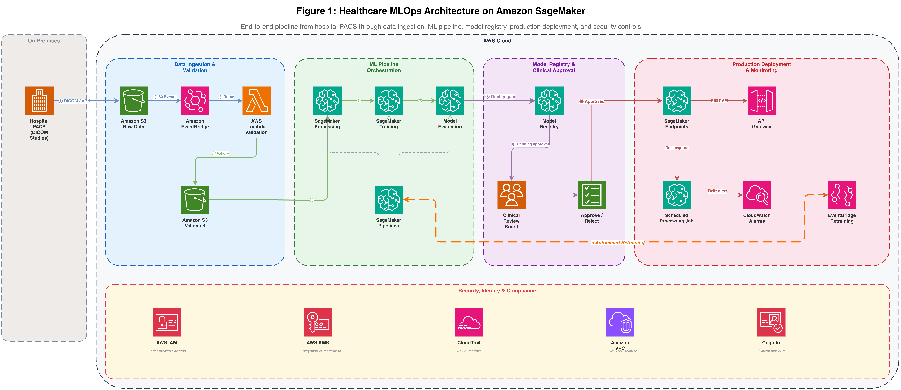
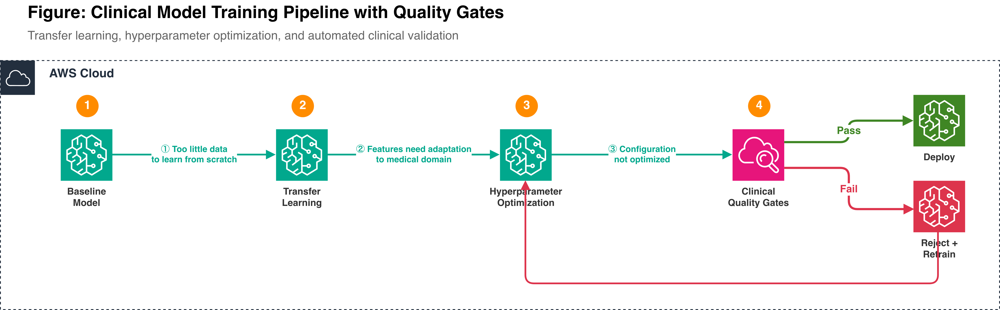
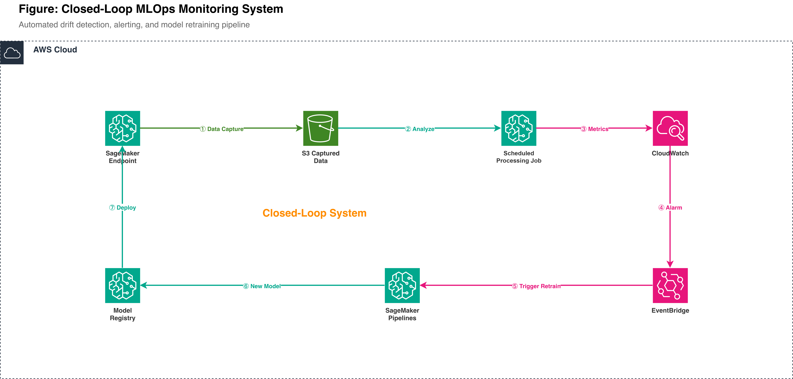
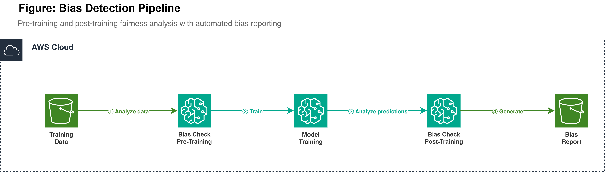
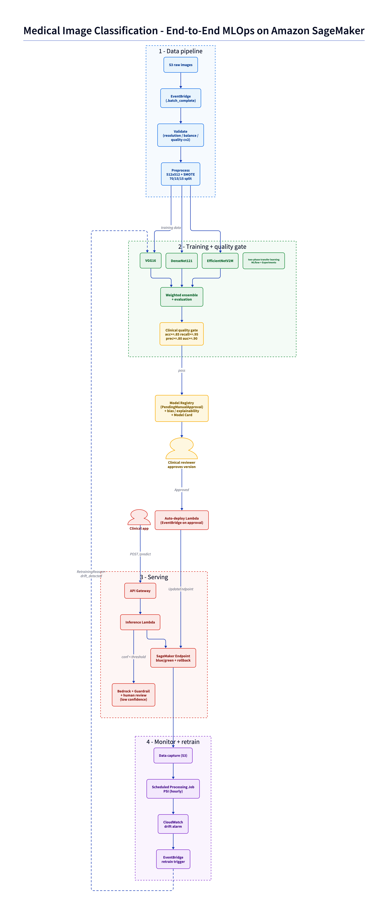

# Image Classification MLOps on Amazon SageMaker

This solution is an end-to-end, production-shaped MLOps pipeline for image
classification on Amazon SageMaker, declared entirely in Terraform. The worked
example classifies medical images as **benign** or **malignant**, but the
architecture is domain-agnostic - swap the dataset and labels to reuse it for
any binary image-classification problem. It implements the full lifecycle from
the four-part healthcare MLOps blog series: event-driven data ingestion and
validation, distributed preprocessing, multi-architecture training with
clinical quality gates, governed (human-approved) deployment, drift-driven
automated retraining, and responsible-AI safeguards (bias, explainability,
guardrails, human review).

Everything that persists - endpoint, auto-scaling, monitors, alarms, registry -
is a native AWS resource managed by Terraform. Lambda functions handle
orchestration only (approve a model, react to drift, serve a prediction), never
infrastructure.

> [!WARNING]
> This solution deploys real, billable AWS resources (a SageMaker real-time
> endpoint, GPU/CPU training jobs, scheduled Processing jobs, CloudTrail, and
> more). Running it incurs cost for as long as it is deployed. It is a reference
> implementation / demo, not a cleared clinical product - the `/predict` API is
> intentionally public and unauthenticated. See [Cost](#cost) and
> [Cleanup](#cleanup), and review [Security](#security) before any real use.

## Table of contents

1. [Architecture](#architecture)
2. [What it does](#what-it-does)
3. [AWS services used](#aws-services-used)
4. [Repository structure](#repository-structure)
5. [Prerequisites](#prerequisites)
6. [Deployment](#deployment)
7. [Usage](#usage)
8. [Cost](#cost)
9. [Cleanup](#cleanup)
10. [Security](#security)
11. [Responsible AI](#responsible-ai)
12. [Key design choices](#key-design-choices)
13. [License](#license)

## Architecture

The solution maps to the four parts of the healthcare MLOps blog series. Each
diagram shows the AWS architecture for that stage.

### Part 1 - Data pipeline (ingestion, validation, preprocessing)



Event-driven ingestion from S3 through validation and distributed SageMaker
Processing into training-ready data, with KMS / IAM / CloudTrail controls.

### Part 2 - Model training with clinical quality gates



Baseline -> transfer learning -> hyperparameter optimization -> clinical quality
gates. A model that clears the gates is registered; one that fails is rejected
and retrained.

### Part 3 - Closed-loop monitoring and retraining



The endpoint captures data; a scheduled SageMaker Processing job computes a
Population Stability Index from it; a CloudWatch drift alarm triggers
EventBridge, which restarts the training pipeline. Human approval is still
required before a retrained model redeploys.

### Part 4 - Responsible AI (bias and explainability)



A bias Processing step computes fairness metrics with Fairlearn, and a condition
step gates registration on them - so a model registers only when it clears both
the accuracy and the fairness thresholds. A failing check writes a bias report to
S3 instead.

Fairness is then re-measured on live traffic. A second scheduled Processing job
joins endpoint data capture with the confirmed diagnostic outcomes clinicians
upload, recomputes demographic parity and equalized odds per subgroup, and
publishes the largest disparity to CloudWatch beside the drift metric - held to
the same threshold the model registered under, and wired into the same
retrain rule. The in-pipeline gate proves a model was fair on the test split; it
cannot see a population shift after deployment.

### End-to-end flow

The full lifecycle, from image upload through the human-approval gate to the
closed-loop drift-triggered retraining:



This diagram is generated from [docs/architecture.d2](docs/architecture.d2) with
[D2](https://d2lang.com): `d2 --layout elk docs/architecture.d2 docs/images/architecture-end-to-end.png`.
Edit the `.d2` source and re-render to update it.

The system is four Terraform roots applied in order. `stack-backend-setup`
bootstraps remote state; `stack-cicd` is the CodePipeline control plane that
deploys `stack-training` and `stack-inference`.

## What it does

1. **Ingest and validate.** Images land in S3; an EventBridge rule starts the
   SageMaker pipeline. A validation step checks resolution, class balance,
   duplicates, and image quality (OpenCV Laplacian / contrast / edge density).
2. **Preprocess at scale.** A SageMaker Processing job standardizes images to
   512x512, applies SMOTE class-balancing, and writes a 70/15/15 split.
   Normalization (`/255` then ImageNet mean/std) is applied identically at
   train, eval, and inference time to avoid training-serving skew.
3. **Train three architectures.** VGG16, DenseNet121, and EfficientNetV2M train
   in parallel using two-phase transfer learning (freeze the backbone and train
   the head, then unfreeze the top layers at a 100x-lower learning rate), with
   early stopping, ReduceLROnPlateau, and SageMaker Experiments plus MLflow
   tracking.
4. **Evaluate and ensemble.** A weighted-average ensemble is built and scored;
   bias and explainability reports are written and attached to the model.
5. **Clinical quality gate.** The pipeline registers the model only if it clears
   accuracy >= 0.85, recall >= 0.95, precision >= 0.80, and AUC >= 0.90. A model
   that misses any threshold fails the pipeline and is never registered.
6. **Govern and deploy.** Models register as PendingManualApproval with full
   lineage metadata. When a reviewer approves a version, EventBridge triggers a
   Lambda that updates the endpoint via blue/green deployment with auto-rollback.
7. **Serve.** API Gateway -> Lambda -> SageMaker endpoint returns a prediction,
   confidence, a per-request id, and (optionally) Bedrock reasoning plus an
   explainability pointer.
8. **Monitor and retrain.** Two scheduled Processing jobs watch the live
   endpoint: one computes prediction drift (PSI) hourly, the other recomputes
   subgroup fairness daily against clinician-confirmed outcomes. Either alarm
   triggers EventBridge, which restarts the training pipeline with
   `RetrainingReason=drift_detected`. Human approval is still required before the
   retrained model redeploys.

## AWS services used

| Area | Services |
| --- | --- |
| Training and ML | SageMaker Pipelines, Training Jobs, Processing Jobs, Model Registry, Model Cards, Experiments, MLflow tracking server |
| Inference | SageMaker real-time Endpoint (KMS-encrypted volume, data capture, blue/green + auto-rollback), Lambda, API Gateway, CloudFront + S3 (static UI) |
| Responsible AI | Fairlearn bias metrics in a Processing step (in-pipeline gate) and a scheduled fairness monitor on live traffic, Grad-CAM / SHAP explainability, Amazon Bedrock (Nova hybrid reasoning) + Bedrock Guardrails |
| Events and orchestration | EventBridge (data-upload trigger, model-approval auto-deploy, drift-to-retrain), EventBridge Scheduler (drift and fairness Processing jobs), Lambda |
| CI/CD | CodePipeline, CodeBuild (training deploy, baseline model, script upload, inference deploy, monthly image patching), CodeStar connection |
| Storage and data | S3 (raw, processed, scripts, model artifacts, inference results, monitoring, SBOM, CloudTrail, state), ECR (patched inference image) |
| Security and governance | KMS (CMK on all data at rest), IAM (least-privilege, PassRole-scoped), CloudTrail (log-file validation), AWS Budgets |
| Observability | CloudWatch (metrics, alarms, dashboards, log groups), X-Ray, SNS alerts |

## Repository structure

```
stack-backend-setup/   # S3 state bucket + KMS key (bootstrap, local state)
stack-cicd/            # CodePipeline + CodeBuild (the control plane)
stack-training/        # SageMaker pipeline, registry, Model Card, MLflow, CloudTrail, budgets
stack-inference/       # Endpoint, Lambda, API Gateway, CloudFront, drift + fairness loop, Bedrock guardrail
modules/               # Reusable Terraform modules (terraform-aws-*)
scripts/               # Production ML scripts the SageMaker pipeline runs
ops-scripts/           # Local operational helpers (cleanup, monitoring checks)
analysis-scripts/      # Chart/visualization generators (blog content)
```

## Prerequisites

- An AWS account and credentials (an admin/dev sandbox - this deploys real,
  billable resources).
- Terraform `~> 1.15` and AWS provider `~> 6.0`.
- AWS CLI v2 (the patched-image bootstrap uses it via `local-exec`).
- Python 3.13+ and [uv](https://github.com/astral-sh/uv) for the baseline-model
  and helper scripts.
- Amazon Bedrock model access enabled for Nova (only if using hybrid inference).

## Deployment

There are two paths. **CI/CD (recommended)** wires everything to a pipeline so
training and inference deploy automatically on every push. **Manual** applies
each Terraform root yourself.

### Step 0 - Bootstrap remote state (once)

```bash
cd stack-backend-setup
terraform init      # local state - the backend does not exist yet
terraform apply
# Copy the state_bucket_id output into the backend.tf of the other three roots.
```

Creates the KMS-encrypted, versioned S3 state bucket and CMK. Uses S3-native
state locking (`use_lockfile = true`), no DynamoDB.

### Path A - CI/CD (recommended)

```bash
cd stack-cicd
terraform init && terraform apply
# Approve the pending CodeStar (GitHub) connection in the AWS Console (one time).
```

CodePipeline then runs, in order:
`Source -> Training-Deploy -> Baseline-Model-Creation -> Script-Upload -> Inference-Deploy`.
The Baseline-Model-Creation stage solves the cold start (an endpoint needs an
approved model before it can exist) by registering a minimal approved model on
first run; it is idempotent.

### Path B - Manual

```bash
# 1. Training infra (pipeline, registry, buckets, IAM, Model Card)
cd stack-training && terraform init && terraform apply

# 2. Upload the ML scripts the pipeline runs
cd ../scripts && SCRIPTS_BUCKET=$(cd ../stack-training && terraform output -raw scripts_bucket) ./script_uploader.sh

# 3. Seed the cold-start baseline model (so the endpoint can be created)
cd .. && MODEL_PACKAGE_GROUP_NAME=$(cd stack-training && terraform output -raw model_package_group_name) \
         MODEL_ARTIFACTS_BUCKET=$(cd stack-training && terraform output -raw model_artifacts_bucket) \
         python stack-cicd/scripts/create_baseline_model.py

# 4. Inference infra (endpoint, Lambda, API GW, monitoring, drift loop)
cd stack-inference && terraform init && terraform apply
```

`stack-inference` automatically builds the patched inference container image
(via a CodeBuild `local-exec` bootstrap) before the endpoint needs it, so no
manual `docker build` / `start-build` is required.

## Usage

### Train a model

Upload images organized as `breast_benign/` and `breast_malignant/` under the
data prefix, then drop the `.batch_complete` marker (the uploader does this):

```bash
./scripts/data_uploader.sh <path-to-data>
```

EventBridge starts the pipeline. When it registers a model
(`PendingManualApproval`), approve it to trigger auto-deployment:

```bash
aws sagemaker update-model-package \
  --model-package-arn <arn-of-new-version> \
  --model-approval-status Approved --profile <your-profile>
```

### Call the API

```bash
API_URL=$(cd stack-inference && terraform output -raw api_gateway_url)
python ops-scripts/test_api.py --api-url "$API_URL" --image-path data/breast_benign/sample.png
```

## Cost

Cost is dominated by anything that runs continuously and by training compute.
Approximate, on-demand, `us-east-1` (verify with the AWS Pricing Calculator):

| Resource | Driver | Rough cost |
| --- | --- | --- |
| SageMaker real-time endpoint (`ml.m5.xlarge`) | runs 24/7 until deleted | ~$0.23/hr (~$165/mo) |
| Scheduled drift job | hourly processing job | a few $/day |
| Scheduled fairness job | daily processing job | a few cents/mo |
| Training pipeline run (3 models) | per run; GPU `ml.p3` if quota allows, else CPU `ml.c5` | ~$1 (CPU dummy) to ~$30-60 (full GPU) |
| S3, KMS, CloudWatch, CloudTrail, Lambda, API GW | storage + low traffic | a few $/mo |

The endpoint is the main standing cost - delete it (or the whole stack) when not
in use. `stack-training` provisions an AWS Budget with alert thresholds.

## Cleanup

To avoid ongoing charges, destroy in reverse dependency order. Buckets must be
emptied before they can be deleted.

```bash
# 1. Remove non-Terraform-managed data + resources (empties buckets, deletes
#    auto-deploy-created models/configs, monitoring data, etc.)
./ops-scripts/cleanup_all.sh

# 2. Destroy the roots in reverse order
cd stack-inference && terraform destroy
cd ../stack-training && terraform destroy
cd ../stack-cicd && terraform destroy
cd ../stack-backend-setup && terraform destroy   # last - holds remote state
```

The drift and fairness schedules are Terraform-managed, so `terraform destroy`
removes them with the rest of `stack-inference`. If a bucket refuses to delete
because it is not empty, re-run `cleanup_all.sh` and retry.

## Security

See [SECURITY.md](SECURITY.md) for the full security posture, accepted demo
trade-offs, production hardening steps, and how to report a vulnerability.

- All data at rest is encrypted with a project KMS CMK; S3 public access is
  blocked on every bucket; SSL-only bucket policies; CloudTrail with log-file
  validation.
- IAM is least-privilege: no AWS-managed `*FullAccess` policies, every
  `iam:PassRole` is scoped by `iam:PassedToService` and an ARN prefix, and
  service actions are ARN-scoped to the project where AWS supports it.
- CI security scanning (SAST, IaC, secret detection, ASH) runs on GitLab CI via
  [.gitlab-ci.yml](.gitlab-ci.yml).
- IaC scanning is clean: `checkov` reports 0 failed checks; every skip is a
  deliberate demo choice documented with a reason in [.checkov.yaml](.checkov.yaml).
  `bandit` reports 0 issues; every suppression is an inline `# nosec` with a
  documented reason. Python lints clean with `ruff`.
- The `/predict` API is intentionally public and unauthenticated for the demo. A
  production deployment should add authentication (Cognito/IAM), a WAF, and a
  VPC; these are documented exceptions, not oversights.

```bash
# Lint + scan locally
ruff check . && ruff format --check .
checkov -d .            # uses .checkov.yaml
bandit -r scripts/ stack-inference/lambda/ analysis-scripts/ modules/

# Validate Terraform (no cloud calls)
for root in stack-backend-setup stack-training stack-inference stack-cicd; do
  (cd $root && terraform init -backend=false && terraform validate)
done
```

## Responsible AI

- **Bias and explainability reports** are produced inside the pipeline and
  attached to each registered model version.
- A **Model Card** documents
  intended use, risk rating, and clinical caveats.
- **Hybrid inference**: low-confidence predictions route to an Amazon Bedrock
  foundation model for natural-language reasoning, constrained by a **Bedrock
  Guardrail** (PII anonymization + content filters).
- **Human review** routes low-confidence cases to a clinician queue (opt-in;
  needs a private workforce).

> Note on data: this project uses public medical images with no demographic
> metadata, so demographic-facet bias monitoring and per-request Grad-CAM are
> provided as opt-in scaffolding rather than always-on features. The bias
> reports use subgroup proxies and label that honestly.

## Key design choices

- **Terraform owns everything that persists.** Endpoints, auto-scaling, monitors,
  and alarms are native resources; no Lambda mutates infrastructure.
- **The registry is the contract.** Training registers; serving consumes only
  approved versions. The two never talk directly, which makes every production
  model traceable to an approval and a training run.
- **The clinical quality gate is a hard pipeline condition**, not advisory.
  Recall is weighted highest because a missed malignant case is the costly error.
- **Human-in-the-loop by design.** Both first deployment and drift-triggered
  retraining register as PendingManualApproval; a person approves before any
  model serves traffic.
- **First deploy is automated.** Baseline model, script upload, and patched-image
  build all run without manual steps.
- **S3-native state locking** (Terraform 1.11+), no DynamoDB.

## License

MIT-0 for code. Dataset licensing is the user's responsibility - do not commit
PHI or PII.
